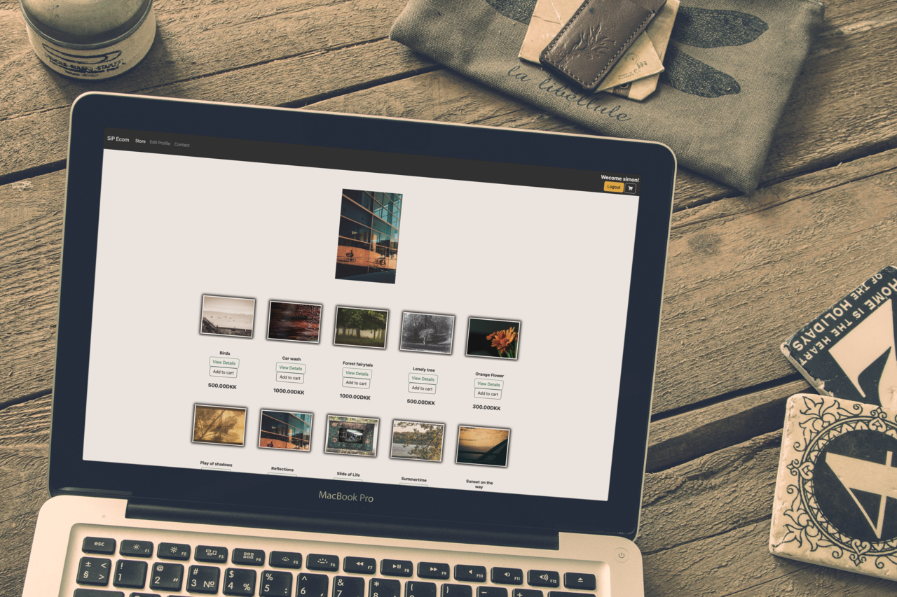
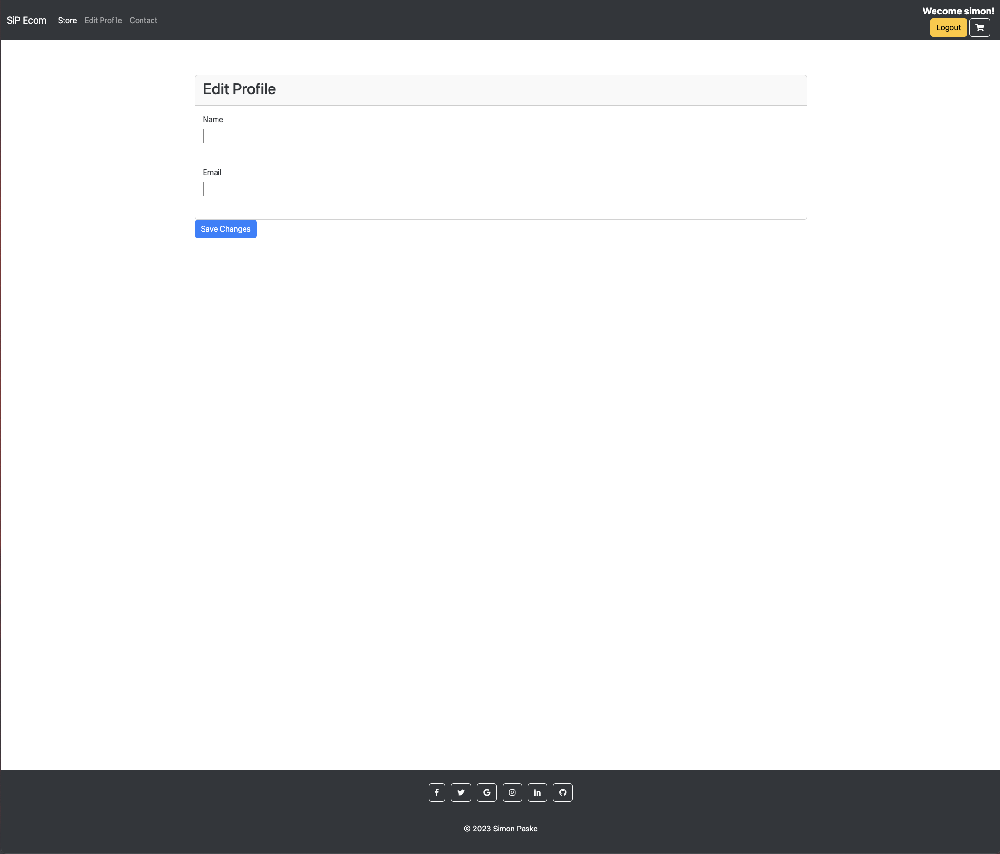
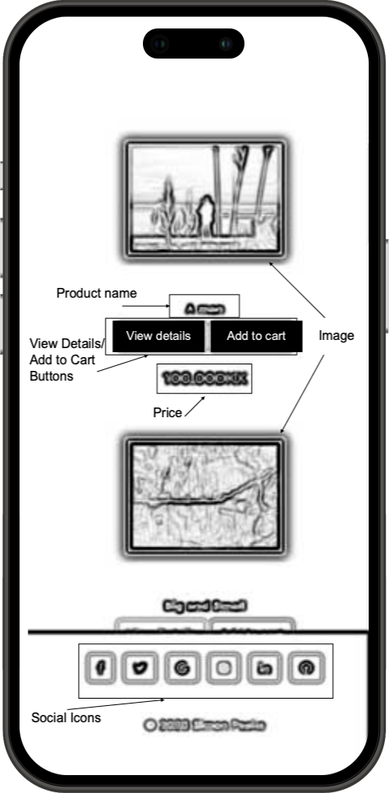

# **Photography E-Commerce Website**

Welcome to the Photography E-Commerce Website! This platform is designed to provide users with a seamless experience for browsing, purchasing, and interacting with a collection of stunning photo prints. Whether you're a photography enthusiast or simply looking to adorn your space with beautiful visuals, this website has something for everyone.
you can find website --> [here](https://sip-home-a6dbdb394c52.herokuapp.com)

 

      

---

# Table of Contents

# Table of Contents

- [**Photography E-Commerce Website**](#photography-e-commerce-website)
- [Table of Contents](#table-of-contents)
- [Table of Contents](#table-of-contents-1)
  - [The-Strategy](#the-strategy)
  - [Site Goals](#site-goals)
    - [1. E-commerce Platform](#1-e-commerce-platform)
    - [2. User Management](#2-user-management)
    - [3. Content Management](#3-content-management)
    - [4. Payment Processing](#4-payment-processing)
    - [5. Customer Interaction](#5-customer-interaction)
    - [6. Responsive Design](#6-responsive-design)
    - [7. Documentation](#7-documentation)
    - [Agile Planning](#agile-planning)
    - [User Stories and Tasks](#user-stories-and-tasks)
      - [Managing Orders (Site Administrator)](#managing-orders-site-administrator)
      - [Reviewing Comments (Site Administrator)](#reviewing-comments-site-administrator)
      - [Managing Photo Prints (Site Administrator)](#managing-photo-prints-site-administrator)
      - [User Profile Management (User)](#user-profile-management-user)
      - [Placing an Order (Buyer)](#placing-an-order-buyer)
      - [Proceeding to Checkout (Customer)](#proceeding-to-checkout-customer)
      - [Managing Cart (Shopper)](#managing-cart-shopper)
      - [Review Photos (User)](#review-photos-user)
      - [Adding to Cart (Shopper)](#adding-to-cart-shopper)
      - [Browsing Photos (User)](#browsing-photos-user)
      - [User Registration (New Customer)](#user-registration-new-customer)
- [Features](#features)
- [Website Features and Elements](#website-features-and-elements)
  - [Navigation Bar](#navigation-bar)
  - [Home Page](#home-page)
  - [Store Page](#store-page)
  - [Product Detail Page](#product-detail-page)
  - [User Profile and Edit Profile](#user-profile-and-edit-profile)
  - [Cart Page](#cart-page)
  - [Checkout Page](#checkout-page)
  - [Contact Page](#contact-page)
  - [Footer](#footer)
  - [404 - Page Not Found](#404---page-not-found)
  - [Features](#features-1)
  - [Page Structure](#page-structure)
  - [Design and Styling](#design-and-styling)
  - [Navigation](#navigation)
  - [Social Media Links](#social-media-links)
  - [Copyright Information](#copyright-information)
- [Payment Process Features and Elements](#payment-process-features-and-elements)
  - [Payment Page](#payment-page)
  - [Payment Form](#payment-form)
  - [Stripe Integration](#stripe-integration)
  - [Payment Confirmation](#payment-confirmation)
  - [Payment Success Page](#payment-success-page)
  - [Extends Base Template](#extends-base-template)
  - [Additional Functionality](#additional-functionality)
- [Favicon Implementation](#favicon-implementation)
  - [Description](#description)
  - [Implementation Details](#implementation-details)
  - [Benefits](#benefits)
- [User Experience on Website](#user-experience-on-website)
  - [Home Page](#home-page-1)
  - [Store Page](#store-page-1)
  - [User Profile and Edit Profile](#user-profile-and-edit-profile-1)
  - [Cart Page](#cart-page-1)
  - [Checkout Page](#checkout-page-1)
  - [Product Reviews](#product-reviews)
  - [Registration and Login](#registration-and-login)
  - [Contact Page](#contact-page-1)
  - [Overall Experience](#overall-experience)
  - [User Interaction](#user-interaction)
  - [Shopping Experience](#shopping-experience)
  - [Admin Management](#admin-management)
  - [User Accounts](#user-accounts)
  - [Wireframes](#wireframes)
    - [Desktop View](#desktop-view)
    - [Mobile View](#mobile-view)
  - [Database Design and Functionality](#database-design-and-functionality)
    - [User Authentication](#user-authentication)
    - [Customer Profile](#customer-profile)
    - [Products](#products)
    - [Product Reviews](#product-reviews-1)
    - [Shopping Cart](#shopping-cart)
    - [Order Items](#order-items)
    - [Shipping Information](#shipping-information)
    - [CRUD Functionality](#crud-functionality)
  - [Database Security Measures](#database-security-measures)
    - [Authentication and Authorization](#authentication-and-authorization)
    - [Data Validation and Sanitization](#data-validation-and-sanitization)
    - [CSRF Protection](#csrf-protection)
    - [HTTPS Encryption](#https-encryption)
    - [Permissions and Access Control](#permissions-and-access-control)
    - [Strong Password Policies](#strong-password-policies)
    - [Input Validation](#input-validation)
    - [Error Handling](#error-handling)
  - [Design Elements Used in Django Templates](#design-elements-used-in-django-templates)
  - [Deployment](#deployment)
  - [Technologies](#technologies)
    - [Frameworks, Libraries, and Programs Used](#frameworks-libraries-and-programs-used)
    - [Languages Used:](#languages-used)
- [Testing](#testing)
  - [Manual Testing Checklist - SiP Home E-Commerce Website](#manual-testing-checklist---sip-home-e-commerce-website)
  - [Home Page](#home-page-2)
  - [Store Page](#store-page-2)
  - [User Profile and Edit Profile](#user-profile-and-edit-profile-2)
  - [Cart Page](#cart-page-2)
  - [Checkout Page](#checkout-page-2)
  - [Product Reviews](#product-reviews-2)
  - [Registration and Login](#registration-and-login-1)
  - [Contact Page](#contact-page-2)
  - [Overall Experience](#overall-experience-1)
  - [Performance](#performance)
  - [Validator testing](#validator-testing)
  - [Checking Website Responsiveness in Different Browsers](#checking-website-responsiveness-in-different-browsers)
    - [Google Chrome](#google-chrome)
    - [Apple Safari](#apple-safari)
    - [Mozilla Firefox](#mozilla-firefox)
- [Future Improvements](#future-improvements)
- [Credits](#credits)
  - [Code](#code)
    - [Star Rating](#star-rating)
    - [User Registration](#user-registration)
    - [Lightbox](#lightbox)
    - [Back to top](#back-to-top)
    - [Stripe](#stripe)
    - [Django message tags and timing](#django-message-tags-and-timing)
    - [Additional code sources](#additional-code-sources)
    - [Media](#media)

## The-Strategy

## Site Goals

### 1. E-commerce Platform
- **Product Listing**: Display products with details such as name, image, category, description, and price.
- **User Registration**: Allow users to register for accounts.
- **Shopping Cart**: Enable users to add and remove items from their shopping cart.
- **Checkout**: Facilitate the checkout process for users to make payments.
- **Order Management**: Manage customer orders, including order creation, tracking, and payment processing.
- **Product Reviews**: Allow users to leave reviews and ratings for products.

### 2. User Management
- **User Registration**: Allow users to create accounts.
- **User Authentication**: Authenticate users during login.
- **User Profiles**: Enable users to edit their profiles.

### 3. Content Management
- **Product Management**: Allow administrators to add and update product details.

### 4. Payment Processing
- **Secure Payments**: Support secure payment processing, including interaction with the Stripe payment gateway.

### 5. Customer Interaction
- **Contact Form**: Provide a means for customers to contact the site through a contact form.

### 6. Responsive Design
- **User-Friendly Experience**: Ensure the site is responsive and accessible on various devices to improve the user experience.

### 7. Documentation
- **Product Reviews**: Document and display product reviews and ratings.

---

### Agile Planning

This project followed an agile development approach, with work organized into three sprints spread evenly over a four-week period.

Each project task was defined as a **User Story** and categorized into priority levels:

- **Must have**
- **Should have**
- **Could have**

 

 

These stories were then assigned to specific **Milestones** and given complexity-based **story points**. The primary focus was on completing the **Must have** stories first, followed by the **Should haves**, and, if time allowed, the **Could haves**. This sequencing ensured that essential project requirements were addressed upfront, providing a comprehensive foundation before adding desirable features.

 

 

A **Kanban board** was established using **GitHub Projects**, accessible [here](link to the Kanban board), where more detailed information about project tasks can be found through project cards. Notably, all stories, except those related to docs, were accompanied by well-defined **acceptance criteria**. These criteria served as clear guidelines for determining when a story could be considered complete.

### User Stories and Tasks

#### Managing Orders (Site Administrator)
- **Description**: As a site administrator, I can manage and process customer orders so that I can change the status of orders.
- **Objective**: Efficiently handle and update order statuses as needed.

#### Reviewing Comments (Site Administrator)
- **Description**: As a site administrator, I can review and moderate comments so that I can filter out objectionable comments.
- **Objective**: Maintain a positive and respectful community by monitoring and managing comments.

#### Managing Photo Prints (Site Administrator)
- **Description**: As a site administrator, I can manage the collection of photo prints so that they are available for sale.
- **Objective**: Ensure that the photo print collection is up-to-date and ready for purchase.

#### User Profile Management (User)
- **Description**: As a user, I can manage my profile information so that I can update my details when necessary.
- **Objective**: Provide users with the ability to maintain accurate and current profile information.

#### Placing an Order (Buyer)
- **Description**: As a buyer, I can place my order and receive a confirmation so that I know my purchase was successful.
- **Objective**: Enable a smooth and reassuring purchase process for buyers.

#### Proceeding to Checkout (Customer)
- **Description**: As a customer, I can proceed to the checkout process so that I can provide shipping and payment details.
- **Objective**: Allow customers to complete the purchase transaction securely.

#### Managing Cart (Shopper)
- **Description**: As a shopper, I can view the contents of my cart, adjust quantities, and remove items so that I can finalize my purchase.
- **Objective**: Provide shoppers with control over their shopping cart contents.

#### Review Photos (User)
- **Description**: As a user, I can leave a review on photos so that I can share my thoughts about the quality.
- **Objective**: Encourage user engagement and feedback on photo prints.

#### Adding to Cart (Shopper)
- **Description**: As a shopper, I can add selected photo prints to my cart so that I can review and purchase them later.
- **Objective**: Allow shoppers to save items for future purchase consideration.

#### Browsing Photos (User)
- **Description**: As a user, I can view a collection of photo prints so that I can choose the ones I like.
- **Objective**: Enable users to explore and select from the available photo prints.

#### User Registration (New Customer)
- **Description**: As a new customer, I can create an account on the website so that I can start shopping, liking, and commenting.
- **Objective**: Facilitate the onboarding process for new customers, enabling them to engage with the site.

These user stories and tasks outline various actions and objectives for both site administrators and users, contributing to the functionality and usability of the website.

---

# Features

# Website Features and Elements

## Navigation Bar

- **Logo**: A website logo with the text "SiP Ecom" that links to the home page.
- **Menu**: A responsive navigation menu with links to different sections of the website.
  - "Store": Takes users to the store page to browse products.
  - "Edit Profile" (for authenticated users): Allows authenticated users to edit their profiles.
  - "Contact": Provides access to the contact page.
- **User Information** (for authenticated users):
  - Displays a welcome message with the username.
  - "Logout" button to log out of the user's account.
  - "Login / Sign Up" button for non-authenticated users.
- **Shopping Cart Icon**: Displays the number of items in the user's cart and links to the cart page.

 

## Home Page

- Displays a carousel with product images that users can interact with.
- Provides a grid of product listings with images, names, prices, and "View Details" and "Add to Cart" buttons.
- Responsive design for various screen sizes.

 

## Store Page

- Lists products with images, names, prices, and "View Details" and "Add to Cart" buttons.
- Allows users to view product details by clicking on a product.
- Responsive design for product listings.

 

## Product Detail Page

- Displays product details including name, description, price, and an image.
- Allows users to add the product to their cart.
- Shows product reviews and ratings.
- Provides a button to leave a review (for authenticated users).

 

## User Profile and Edit Profile

- Allows users to view and edit their profile information (for authenticated users).
- User can edit their name and email.
- Displays success messages upon profile updates.

 

## Cart Page

- Shows a list of items in the user's cart with names, quantities, and total prices.
- Allows users to update item quantities or remove items.
- User can view details of the product by clicking on the product name
- Provides a "Proceed to Checkout" button.

 

## Checkout Page

- Displays a payment form for users to enter shipping information.
- Supports secure payment processing.
- Shows order summary and total.
- Confirms successful payment with an order confirmation or success page.

 

## Contact Page

- Provides a form for users to submit messages with fields for name, email, and message.
- Validates user input and sends messages successfully.
- Responsive design for the contact form.

 

## Footer

- Displays social media icons with links (Facebook, Twitter, Google, Instagram, LinkedIn, GitHub).
- Includes a copyright notice with a link to the website creator's portfolio.

 

---

## 404 - Page Not Found

This page serves as a user-friendly 404 (Page Not Found) error page to inform visitors that the requested page does not exist on the website.

## Features

- **Page Title:** Displays a prominent "404 - Page Not Found" title in red text to catch the user's attention.

- **Error Message:** Provides a brief error message informing the user that the page they are looking for does not exist.

- **Return to Home:** Offers a link to the home page, allowing users to easily navigate back to the main page by clicking on the "Return to the home page link.

## Page Structure

The 404 page is structured as follows:

- **Header:** The website's header, including the site logo, navigation menu, and any other common elements, is not present on the 404 page to keep it simple and focused.

- **Main Content:** The main content of the 404 page consists of a jumbotron or banner at the center of the page. Within this banner:
    - The "404 - Page Not Found" title is displayed in a large, red font to clearly indicate the error.
    - A short error message informs the user that the requested page does not exist.
    - A "Return to the home page" link is provided, directing users to the main page of the website.

- **Footer:** A minimal footer is included at the bottom of the page, displaying social media icons for various platforms, as well as the copyright information. The footer remains consistent with the website's design.

## Design and Styling

The page follows the overall design and styling of the website to maintain a cohesive user experience. It uses the website's color scheme, fonts, and icons for consistency.

## Navigation

The 404 page includes a single navigation link that allows users to return to the home page. This link is styled as a clickable text.

## Social Media Links

In the footer section, social media icons with links to various social media profiles are provided. Users can click on these icons to visit the website owner's social media pages.

## Copyright Information

The footer also contains copyright information with a link to the website owner's portfolio.

---

By providing a user-friendly and informative 404 error page, visitors who encounter missing or broken links can easily navigate back to the home page or explore other parts of the website.

---

# Payment Process Features and Elements

 

## Payment Page

- A checkout page that displays a payment form for users to enter shipping and payment information.
- Supports secure payment processing.

 
## Payment Form

- Includes a payment form with the following elements:
  - **Card Element**: A Stripe card element where users can enter their credit card information securely.
  - **CSRF Token**: Ensures security by including a CSRF token in the form.
  - **Error Display**: A section to display form errors in case of payment issues.

## Stripe Integration
- Integrates with the Stripe payment gateway for processing payments securely.
- Uses the Stripe.js library to handle card payments.
- Configures the Stripe.js library with the Stripe publishable key from the Django settings.

## Payment Confirmation
- Handles form submission through JavaScript and prevents the default form submission behavior.
- Calls the Stripe `confirmCardPayment` method to initiate the payment confirmation process with the provided `client_secret`.
- Displays any payment errors to the user if the payment is not successful.

## Payment Success Page

- Redirects the user to a "Payment Success" page upon successful payment confirmation.
- Displays a success message to the user confirming that the payment was received.
- Provides a link to return to the home page.

## Extends Base Template
- Utilizes the base HTML template (`store/base.html`) for consistent website branding and navigation elements.
- Loads static assets and defines content blocks as needed.

These features and elements together create a seamless payment process within the website, allowing users to securely enter payment information, receive payment confirmation, and proceed to a payment success page.

 

## Additional Functionality

  

- Lightbox feature for product images. Users can click on an image to view it in a larger size. Footer hides when lightbox is open.
- Star rating system for product reviews.
- Cart notification messages to inform users of cart updates.
- Back to top disappearing button after 5s of inactivity
- Ability to leave product reviews and view existing ones.
- User registration and login functionality.

These features and elements create a comprehensive e-commerce website with essential user interface components and functionality for users to browse, shop, and interact with products and reviews.

---

# Favicon Implementation

## Description
- **Favicon**: Added a website favicon for improved user experience and branding.
- **Purpose**: Favicon is a small icon displayed in the browser tab or bookmark list, making it easier for users to identify and remember your website.

---

## Implementation Details
- **Favicon Image**: Designed or selected a suitable favicon image (usually in .ico, .png, or .svg format) that represents the website or brand identity.
- **HTML Integration**: Inserted the favicon into the website's HTML code by including a `<link>` tag in the `<head>` section of each HTML page.
- **Consistency**: Ensured that the same favicon is used across all pages for a cohesive user experience.
- **Browser Compatibility**: Checked and confirmed that the favicon displays correctly across different web browsers.

## Benefits
- **Brand Recognition**: A favicon reinforces brand recognition by displaying a unique logo or symbol associated with the website.
- **User-Friendly**: Enhances user experience by providing a visual identifier for the website in browser tabs.
- **Professionalism**: Adds a professional touch to the website, indicating attention to detail.
- **Bookmarking**: Makes it easier for users to locate and identify the website in their bookmarks or history.

By implementing a favicon, the website enhances its visual appeal and user-friendliness, contributing to a more memorable and professional online presence.

---

# User Experience on Website

## Home Page
Upon landing on the website, users are greeted with an intuitive and visually appealing interface. The home page provides a seamless and responsive design, ensuring that it looks great on both desktop and mobile devices. 

The main elements on the home page include:

- **Navigation Menu:** A clear and easy-to-navigate menu at the top of the page allows users to explore different sections of the website, including the store, user profile, and more.

- **Product Listings:** Users are presented with a grid of products, each with an image, name, and price. This layout makes it convenient for users to quickly browse through available products.

- **Cart Indicator:** For logged-in users, a cart indicator displays the number of items in their cart, providing a visual reminder of their shopping status.

## Store Page
When users click on the "Store" link, they are taken to the store page where they can view a wider range of products. Here, they can:

- **View Product Details:** By clicking on a product, users can access detailed information, including product images, descriptions, and pricing.

- **Add to Cart:** Users can easily add products to their shopping cart, and the cart indicator updates automatically, giving them real-time feedback on their selections.

## User Profile and Edit Profile
The "User Profile" link allows registered users to access and update their profile information. Here, they can:

- **Edit Profile:** Users can modify their name and email address through a user-friendly form. Upon saving changes, a success message confirms the update.

## Cart Page
Users can access their shopping cart by clicking on the cart icon or selecting "Cart" from the navigation menu. In the cart, they can:

- **Review Cart Contents:** Users can see a detailed list of the items they've added, including product names, quantities, and total prices.

- **Update Cart:** Users can adjust item quantities or remove items entirely.

- **Proceed to Checkout:** When ready to complete their purchase, users can proceed to the checkout page.

## Checkout Page
The checkout page provides a smooth and secure experience for users to finalize their purchase. Here, users can:

- **Enter Shipping Information:** If applicable, users can input their shipping address.

- **Payment:** Users can securely enter their payment information. The integration with Stripe ensures a secure transaction process.

## Product Reviews
For each product, users have the option to leave reviews and ratings. This feature adds transparency and trust to the shopping experience.

## Registration and Login
For new users, the website offers a straightforward registration process. Once registered, users can log in using their credentials. The website provides informative feedback for successful login and registration.

## Contact Page
The "Contact" page offers an easy way for users to get in touch with the website administrators. Users can provide their name, email, and message, making it simple to seek assistance or provide feedback.

## Overall Experience
The website provides a seamless and enjoyable user experience, from browsing products to completing purchases. It prioritizes user convenience, clear navigation, and a responsive design. Additionally, user feedback is integrated into the shopping experience through product reviews and the contact page, enhancing user engagement and satisfaction.

---

## User Interaction

- **Reviewing Comments**: As a site administrator, you have the power to review and moderate comments to maintain a positive and engaging environment.
- **Reviewing Photos**: Express your opinions about the quality and aesthetic of the photos by leaving detailed reviews.

## Shopping Experience

- **Browsing Photos**: Discover a diverse collection of photo prints and explore a range of themes and styles.
- **Adding to Cart**: Shoppers can add their favorite photo prints to the cart, allowing them to review and purchase their chosen items at a later time.
- **Managing Cart**: View the contents of your cart, adjust quantities, and remove items as needed, ensuring a smooth checkout process.
- **Placing an Order**: Buyers can easily place orders and receive confirmations, assuring that their purchase was successful.
- **Proceeding to Checkout**: Customers can proceed to the checkout process, where they can input shipping and payment details to finalize their purchase.

## Admin Management

- **Managing Orders**: As a site administrator, you can efficiently manage and process customer orders, including changing the status of orders as necessary.
- **Reviewing and Moderating**: Admins have the ability to review and moderate reviews, ensuring that objectionable content is filtered out.
- **Managing Photo Prints**: Admins curate the collection of photo prints available for sale, ensuring a high-quality selection.

## User Accounts

- **User Profile Management**: Users can easily manage their profile information, allowing them to update details whenever required.
- **User Registration**: New customers can create accounts on the website, granting them the ability to start shopping and leave reviews.

---

## Wireframes

### Desktop View

**Home page**

**Product details**

**Cart**

**Checkout**

**Contact**

**Contact Successfull**

**Edit profile**

**Login**

**Register**

**Product Reviews**

**Payment Form**

**Payment Success**

**Lightbox**

**404 - Page Not Found**

---

### Mobile View

 

**Home page**

 

**Product details** / **Cart**

 

**Checkout**

 

**Contact** / **Burger Menu**

 

 

**Edit profile** / **Login**

 

**Register** / **Product Reviews**

 

**Payment Form** / **Payment Success**

 

**Lightbox** / **404 - Page Not Found**

 

---

## Database Design and Functionality

### User Authentication
- Registered users can create accounts and log in using Django Allauth.
- The `User` model from Django's built-in `auth` module is extended to include user-specific information.

### Customer Profile
- Each registered user has a corresponding `Customer` profile, established through a one-to-one relationship.
- The `Customer` model stores user-related information such as name, email, and address.

### Products
- The `Product` model represents the products available in the store.
- Users can perform CRUD operations on products based on their permissions.
- Each product has a name, image, category, description, price, and a flag indicating whether it's digital or physical.

### Product Reviews
- Registered users can submit product reviews, including ratings and feedback.
- The `ProductReview` model establishes a many-to-one relationship between products and customers for reviews.
- Reviews include ratings, feedback, and the date they were added.

### Shopping Cart
- Users can add products to their shopping carts, and this data is associated with their customer profile.
- The `Order` model represents a user's order, which includes information like the order date and transaction ID.
- The shopping cart can be marked as "complete" when the user proceeds to checkout.

### Order Items
- The `OrderItem` model links products, orders, and customers.
- Users can add, update, or remove items from their cart, which creates or modifies order items.
- Order items have quantities and a date added.

### Shipping Information
- Users can provide shipping information when proceeding to checkout.
- The `ShippingAddress` model connects customers and orders, storing address details.
- Shipping information is associated with an order.

### CRUD Functionality
- Registered users have CRUD functionality for products, allowing them to:
  - Read product details and reviews.
  - Update product information.
- Users can also perform CRUD operations on their shopping carts:
  - Add products to the cart.
  - Update the quantity of items in the cart.
  - Remove items from the cart.
  - Complete an order.
- CRUD operations are available for product reviews:
  - Add a review.
  - Read existing reviews.
- Shipping information can be created, read, updated, and deleted by users during checkout.

This database design and functionality provide registered users with a comprehensive e-commerce experience, including the ability to manage their profiles, browse products, add items to their cart, submit reviews, and complete orders. It follows best practices for Django-based web applications and provides a smooth shopping experience.

---

## Database Security Measures

### Authentication and Authorization
- The project uses Django's built-in authentication system, which securely stores user passwords using hash algorithms.
- Access to specific CRUD operations and database records is controlled through Django's authorization system.
- Only registered users with the appropriate permissions can perform sensitive operations such as adding, updating, or deleting products.

### Data Validation and Sanitization
- Input validation is enforced at the application level to prevent SQL injection and other common web vulnerabilities.
- Django's forms and model validations help ensure that data entering the database adheres to predefined rules, reducing the risk of data corruption.

### CSRF Protection
- The project uses Django's built-in Cross-Site Request Forgery (CSRF) protection.
- This protection mechanism generates and verifies tokens for form submissions, preventing malicious actors from executing unauthorized actions on behalf of users.

### HTTPS Encryption
- Secure Socket Layer (SSL) or Transport Layer Security (TLS) encryption is utilized to secure data transmission between the user's browser and the server.
- This ensures that sensitive information, such as login credentials and payment details, is encrypted during transit.

### Permissions and Access Control
- Granular permissions are assigned to user roles (e.g., customers, administrators) to restrict access to specific database records and functionalities.
- Role-based access control (RBAC) helps prevent unauthorized access to critical data and operations.

### Strong Password Policies
- The project enforces strong password policies to encourage users to create complex passwords.
- This includes minimum length requirements, character diversity, and password expiration policies.

### Input Validation
- User inputs, such as form data, are thoroughly validated and sanitized to prevent malicious input from compromising the database.
- Validation rules are enforced both on the client and server sides to ensure data integrity.

### Error Handling
- Detailed error messages are handled carefully to prevent exposing sensitive information in error responses.
- Generic error messages are presented to users, while more detailed errors are logged for debugging purposes.

By implementing these security measures, the current database design aims to protect sensitive user data, prevent common web vulnerabilities, and maintain the integrity and confidentiality of the application's database. However, it's essential to continually monitor and update security practices to stay resilient against emerging threats.

---
## Design Elements Used in Django Templates
1. **Color Theme:** The templates use a consistent color theme with a dark background (`bg-dark`) for headers and footers, light backgrounds for content sections, and contrasting text colors (`text-white` on dark backgrounds). Buttons and elements have carefully chosen color schemes for visual appeal and clarity.

2. **Typography:** Typography is employed to create a clear hierarchy of content. Headings use varying font sizes to establish visual distinctions, and Bootstrap classes are used to style form elements and buttons for consistency and readability. Fonts are kept standard for better web compatibility.

3. **Imagery:** Images are used strategically to enhance visual appeal and convey information. Product detail pages showcase product images with a lightbox effect for a better view. Social media icons provide visual cues and links in the footer.

---
## Deployment

The project was stored on GitHub and deployed on Heroku. Before deployment make sure that a requirements.txt file is created using the command `pip3 freeze > requirements.txt`.
To deploy the project, the following steps were taken:

1. Log in to [ElephantSQL.com](https://www.elephantsql.com/) to access your dashboard

1. Set up your plan and select region.

1. Select a data center near you

1. Then click “Review”

1. Click “Create Instance”

1. Click on the instance you just created

1. In the URL section, click the copy icon to copy the database URL.

1. Create a file called **env.py**.
   1. In your **env.py** file add the following line of code  **import os**
   2. First, add a blank line, then set a DATABASE_URL variable, with the value you just copied from ElephantSQL as follows and then create a SECRET_KEY variable:

1. Create a Procfile. In the Procfile, add the following line of code with your app name:
`web: gunicorn appname.wsgi`

1. Migrate you models to the database using the command `python3 manage.py migrate`.
2. Add, commit, and push the changes to GitHub.
3. Connect the GitHub repository to the Heroku app.
4. Create a new app on Heroku.

1. Give your app a name and select the region closest to you. When you’re done, click “Create app” to confirm

1. Click on Heroku dashboard open the Settings tab
    

2. Set the following config vars in Heroku:
    - AWS_ACCESS_KEY_ID
    - AWS_SECRET_ACCESS_KEY
    - DATABASE_URL
    - EMAIL_HOST_PASS
    - EMAIL_HOST_USER
    - SECRET_KEY
    - STRIPE_PUBLIC_KEY
    - STRIPE_SECRET_KEY
    - STRIPE_WH_SECRET
    - USE_AWS
    - DISABLE_COLLECTSTATIC
    

3. In the Heroku dashboard, click on the “Deploy” tab, then scroll down to “Deployment method” and select GitHub.

1. In the “Connect to GitHub” section, make sure your GitHub profile is displayed, then add your repository name and click “Search”.

20. Once your repo is found, click “Connect” to complete the connection.

21. In the “Automatic deploys” section, click “Enable Automatic Deploys” to deploy the app to Heroku every time you push to GitHub.

22. In the “Manual deploy” section, select the master branch then click “Deploy Branch”.

23. Once the build is complete, click “View” to launch your new app.

---
## Technologies

### Frameworks, Libraries, and Programs Used

- **Django**: The project uses Django as the web framework.
- **PostgreSQL**: The project uses PostgreSQL as the database.
- **Heroku**: The project is deployed on Heroku.
- **AWS S3**: The project uses AWS S3 to store static and media files.
- **Stripe**: The project uses Stripe to handle payments.
- **Bootstrap**: The project uses Bootstrap for styling.
- **jQuery**: The project uses jQuery for interactivity.
- **Font Awesome**: The project uses Font Awesome for icons.
- **Git**: The project uses Git for version control.
- **GitHub**: The project uses GitHub for version control.
- **GitPod**: The project uses GitPod as the IDE.
- **Justinmind and Photoshop**: The project uses Justinmind for wireframing.
- **Lucidchart**: The project uses Lucidchart for database modeling.
- **Gunicorn**: The project uses Gunicorn as the WSGI HTTP Server.
- **PIP**: The project uses PIP as the package manager.
- **Django Allauth**: The project uses Django Allauth for user authentication.
- **Psycopg2**: The project uses Psycopg2 to connect to PostgreSQL.
- **W3C Markup Validator**: The project uses W3C Markup Validator to validate HTML code.
- **W3C CSS Validator**: The project uses W3C CSS Validator to validate CSS code.
- **JSHint**: The project uses JSHint to validate JavaScript code.
- **PEP8**: The project uses PEP8 to validate Python code.
- **Chrome DevTools**: The project uses Chrome DevTools for testing and debugging.
- **VSCode**: The project uses VSCode as the code editor.
- **ElephantSQL**: The project uses ElephantSQL as the PostgreSQL database provider.
- **Cloudinary**: The project uses Cloudinary to store images.
- **SQLAlchemy**: The project uses SQLAlchemy to connect to PostgreSQL.
- **asgiref**: ASGI (Asynchronous Server Gateway Interface) reference implementation.
- **dj-database-url**: A Django utility for parsing database URLs from an environment variable.
- **Favicon**: The project uses a favicon for improved user experience and branding.
- **MagicMockup**: The project uses MagicMockup to generate mockup images.

---

### Languages Used:

- **HTML**: The project uses HTML to structure the content.
- **CSS**: The project uses CSS to style the content.
- **JavaScript**: The project uses JavaScript to add interactivity.
- **Python**: The project uses Python to handle the backend functionality.
- **Markdown**: The project uses Markdown to write the README file.
- **JSON**: The project uses JSON to store data.
- **SQL**: The project uses SQL to query the database.

---
# Testing

## Manual Testing Checklist - SiP Home E-Commerce Website

## Home Page

- [x] Verify that the home page loads correctly without errors.
- [x] Check that the navigation menu is visible and functional.
- [x] Ensure that the product listings are displayed correctly with images, names, and prices.
- [x] Test the responsiveness of the home page by resizing the browser window.
- [x] Verify that the cart indicator (if logged in) shows the correct number of items.

## Store Page

- [x] Click on a product to view its details, and verify that the product page loads correctly.
- [x] Check that the product images, descriptions, and prices are displayed accurately.
- [x] Attempt to add a product to the cart and confirm that the cart updates accordingly.
- [x] Test the "Add to Cart" button to ensure it functions as expected.

## User Profile and Edit Profile

- [x] Access the user profile page and verify that it displays the user's information.
- [x] Edit the user's profile by modifying the name and email address and confirm that changes are saved successfully.
- [x] Ensure that appropriate success messages are displayed after profile edits.

---

**Bug Report:**

**Issue:** When editing the profile and clicking the "Save" button, the changes are successfully saved, but the success message is not displayed immediately. Instead, the success message only appears when the user clicks the "Edit Profile" button again.

**Description:**

- Upon editing the user's profile information, it's expected that a success message should be displayed to confirm that the changes have been saved successfully.
- Currently, after clicking "Save," the page redirects to the home page without showing the success message.
- The success message only becomes visible when the user goes back to the "Edit Profile" page, which can be confusing and doesn't provide real-time feedback.

**Expected Behavior:**

- After clicking the "Save" button when editing the profile, the success message should be displayed immediately to inform the user that their changes have been saved successfully.
- The success message should be shown on the same page where the user initiated the profile editing process.

**Steps to Reproduce:**

1. Log in to the user profile.
2. Navigate to the "Edit Profile" section.
3. Make changes to the profile information.
4. Click the "Save" button.
5. Observe that the success message is not displayed.
6. Click the "Edit Profile" button again to see the success message.

**Fix Description:**

The issue was fixed by implementing JavaScript code that utilizes Django's messages tags and pop-up notification timing for disappearance. Now, after clicking "Save" when editing the profile, a success message is displayed in real-time to confirm the successful saving of changes. The message automatically disappears after a set duration, providing a more user-friendly experience.

---

## Cart Page

- [x] Click on the cart icon or select "Cart" from the menu to access the cart page.
- [x] Verify that the cart displays a list of items with their names, quantities, and total prices.
- [x] Test the functionality to update item quantities and remove items from the cart.
- [x] Confirm that the "Proceed to Checkout" button takes users to the checkout page.

---

**Bug Report:**

I noticed an issue while browsing on mobile devices where the cart summary headers are displayed with longer text, causing them to extend beyond the screen width. This results in a less than optimal user experience as it makes it difficult to view and navigate the cart summary.

**Issue Description:**

- On mobile screens, when items are added to the cart, the headers in the cart summary appear to be too long for the screen width.
- The longer headers cause horizontal scrolling, which can be frustrating for users as it disrupts the overall mobile experience.

**Suggested Fix:**

The issue was fixed by making the following adjustments:

- Removed one column from the cart summary table to reduce the width of the table.
- Positioned the buttons "Remove" and "Add" in line with the quantity column to save horizontal space and ensure a better mobile user experience.

---

## Checkout Page

- [x] Access the checkout page and check for the presence of a secure payment form.
- [x] Enter valid shipping information (if applicable) and verify that it is processed correctly.
- [x] Test the payment process by entering valid payment information.
- [x] Confirm that a successful payment results in an order confirmation or success page.
- [x] Test the behavior when entering invalid payment information.

## Product Reviews

- [x] Navigate to a product page and check if users can leave product reviews.
- [x] Leave a review and rating for a product to ensure the process is straightforward.
- [x] Confirm that submitted reviews and ratings are displayed correctly on the product page.

## Registration and Login

- [x] Register a new user account and verify that the registration process is successful.
- [x] Log in using the newly created account and ensure that the login process works as expected.

## Contact Page

- [x] Access the contact page and verify that it displays the required fields for name, email, and message.
- [x] Submit a message through the contact form and confirm that it is sent successfully.
- [x] Test the contact form with incomplete or incorrect information to check for validation.

## Overall Experience

- [x] Perform cross-browser testing (e.g., Chrome, Firefox, Safari) to ensure compatibility.
- [x] Test the website's responsiveness on various devices (e.g., desktop, tablet, mobile).
- [x] Verify that error messages are displayed when necessary (e.g., login failures, invalid form submissions).
- [x] Check for broken links or images throughout the website.
- [x] Test the website's performance by loading pages with a reasonable amount of data.
- [x] Confirm that the website's design is consistent and visually appealing.
  
---

## Performance

This manual testing checklist was completed. The website was tested on various devices and browsers to ensure compatibility and responsiveness. The website was also tested for performance and design consistency with Google Lighthouse and [GTmetrix](https://gtmetrix.com/). [Link for performance results](https://gtmetrix.com/reports/sip-home-a6dbdb394c52.herokuapp.com/RPc24nuw/).

---

## Validator testing

**HTML Validation Process:**

All pages have undergone validation using the W3 HTML Validator to ensure compliance with HTML standards.

However, it's important to note that certain pages utilize Django's templating language code within the HTML files. As a result, these pages cannot be directly copied and pasted into the validator due to the presence of dynamic content generated by Django.

By following these steps, you can accurately validate pages that contain Django templating language code or pages with login requirements or secured views.

---

**Code Validation Feedback:**

The Python code was checked using [Pythonchecker](pythonchecker.com) since the http://pep8online.com/ website was temporarily offline. The evaluation results indicate that the code appears to be in good shape without any major issues.

Additionally, the code was formatted using Visual Studio Code (VS Code) with the assistance of Python checker tools. This helps maintain a consistent and organized codebase.

**JavaScript Validation Feedback:**

I ran the JavaScript code through JSHint, a JavaScript validator.
It's worth noting that the functions were called via 'onclick' from the HTML elements themselves, confirming that these variables are indeed being used in code.

Back to to js

Cart js

Lightbox js

Message timeout js

---

## Checking Website Responsiveness in Different Browsers

### Google Chrome

1. **Open Chrome:** Launch Google Chrome on your computer.

2. **Access Developer Tools:** Right-click anywhere on your webpage and select "Inspect" or press `Ctrl + Shift + I` (or `Cmd + Option + I` on Mac) to open the Chrome Developer Tools panel.

3. **Toggle Device Toolbar:** In the Developer Tools panel, click the device icon (usually located at the top-left corner) or press `Ctrl + Shift + M` (or `Cmd + Option + M` on Mac) to toggle the Device Toolbar.

4. **Choose Device:** Use the Device Toolbar to select various device presets or specify custom screen dimensions. This allows you to view your website as it would appear on different devices, such as smartphones, tablets, and desktops.

5. **Test Responsiveness:** Interact with your website, and Chrome will automatically simulate the selected device's viewport. Ensure that your website adjusts correctly to different screen sizes and orientations.

### Apple Safari

1. **Open Safari:** Launch Safari on your Mac.

2. **Enable Developer Tools:** Go to Safari Preferences (`Cmd + ,`) and click on the "Advanced" tab. Check the box that says "Show Develop menu in menu bar."

3. **Access Responsive Design Mode:** In the Safari menu bar, click "Develop," and then select "Enter Responsive Design Mode." Alternatively, press `Cmd + Option + R`.

4. **Select Device:** In Responsive Design Mode, you can choose from various device presets or enter custom dimensions to test your website's responsiveness.

5. **Preview Responsiveness:** Interact with your website to see how it adapts to different screen sizes and orientations. Safari provides a live preview of your site's responsiveness.

### Mozilla Firefox

1. **Open Firefox:** Launch Mozilla Firefox on your computer.

2. **Access Responsive Design Mode:** Right-click anywhere on your webpage and select "Inspect Element" or press `Ctrl + Shift + I` (or `Cmd + Option + I` on Mac) to open the Firefox Developer Tools.

3. **Toggle Responsive Design Mode:** In the Developer Tools panel, click the responsive design icon (represented by two overlapping rectangles) or press `Ctrl + Shift + M` (or `Cmd + Option + M` on Mac) to toggle Responsive Design Mode.

4. **Choose Device:** You can choose from predefined device sizes or specify custom dimensions to emulate various screen sizes and orientations.

5. **Inspect Responsiveness:** Firefox will show your website in the selected viewport. Test how your site responds to different screen sizes by interacting with it.

By following these steps in Chrome, Safari, and Firefox, you can thoroughly evaluate and fine-tune your website's responsiveness for a wide range of browsers and devices.

---

# Future Improvements

1. **Search Products Functionality**: Implement a search feature to allow users to search for products by name, description, or other relevant criteria.

2. **Integration with Gelato for Printing and Delivery**: Connect the website with Gelato or a similar service to facilitate the printing and delivery of products, enabling a seamless user experience.

3. **Categories Filter for Products**: Add a category filter to help users quickly narrow down their product selection, making it easier to find what they're looking for.

4. **Order History**: Provide users with access to their order history, allowing them to view past orders, track shipments, and reorder items.

5. **Password Reset Functionality**: Implement a password reset feature that enables users to reset their passwords securely in case they forget or need to change them.

6. **Email Notifications for New Products and Password Changes**: Offer users the option to receive email notifications about new product arrivals and any changes made to their passwords, enhancing user engagement and security.

7. **Profile Photo Upload for Customers**: Allow customers to personalize their profiles by uploading profile photos, creating a more personalized and visually appealing user experience.

These improvements aim to enhance the functionality, user experience, and security of the website, providing a more comprehensive and user-friendly platform.

---

# Credits

## Code

### Star Rating

Inspiration and part of the code for the star rating system was taken from [Medium](https://medium.com/geekculture/django-implementing-star-rating-e1deff03bb1c), [mboostrap](https://mdbootstrap.com/docs/b4/jquery/plugins/rating/), [wildfish](https://django-star-ratings.readthedocs.io/en/latest/).

### User Registration

Inspiration and part of the code for User registration system was taken from [ordinarycoders](https://ordinarycoders.com/blog/article/django-user-register-login-logout), [Dennis Ivy](https://www.youtube.com/watch?v=tUqUdu0Sjyc) and Code Institute material.

### Lightbox

Inspiration and part of the code for Lightbox feature system was taken from [Lokesh Dhakar](http://lokeshdhakar.com/projects/lightbox2/).

### Back to top

Inspiration and part of the code for Back to top feature system was taken from [mboostrap](https://mdbootstrap.com/docs/standard/extended/back-to-top/)

### Stripe

Inspiration and part of the code for Stripe system integration was taken from [Mishel Shaji](https://www.geekinsta.com/integrate-stripe-with-django/)

### Django message tags and timing

Inspiration and part of the code for Django message tags and timing was taken from [Stack Overflow](https://stackoverflow.com/questions/13932653/increase-displaying-time-of-django-messages)
### Additional code sources

- [Stack Overflow](https://stackoverflow.com/)
- [W3Schools](https://www.w3schools.com/)
- [Code Institute](https://codeinstitute.net/)
- [Django Documentation](https://docs.djangoproject.com/en/3.2/)
- [Bootstrap Documentation](https://getbootstrap.com/docs/4.6/getting-started/introduction/)
- [Geekinsta](https://www.geekinsta.com/)
- [Stripe](https://stripe.com/docs)
- [Dennis Ivy](https://dennisivy.com)

### Media

Mockups were made using [Magic Mockups](http://magicmockups.com)
- Image credit: Unsplash
- Image credit: Startup Stock Photos
- Image credit: Madebyvadim
- Image credit: Firmbee

Images used for the website is photo credited to [Simon Paske](http://sip.myportfolio.com) &copy;